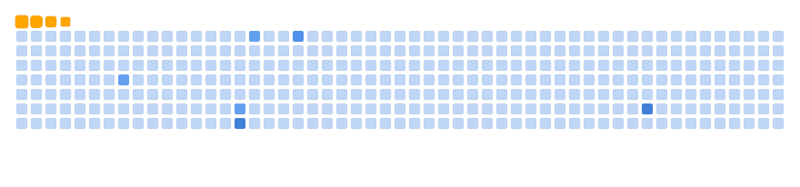

<!-- Banner -->

  

<h1 align="center">Hi, I'm devilkadabra69 👋</h1>

  
  
  
  

## 🚀 Dashboard
- **Role:** Software Engineer @ LTI Mindtree  
- **Skills:** Java · Python · Spring Boot · Machine Learning · Generative AI  
- **Current:** Building Finance Hub & AI tools

### 📊 GitHub Stats

  
  

### 🌱 Activity Graph

  

### 🐍 Contribution Snake

  
  
  

<!-- Optional collapsible sections -->

  
📂 Featured Projects

- Finance Hub – Angular + Spring Boot
- AI RAG Utilities – Python, FastAPI
- Community Chat – WebSockets + React

  

